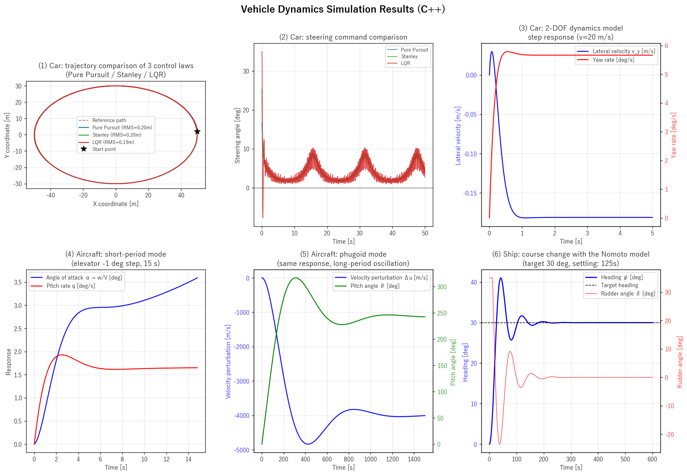

# Vehicle Dynamics Simulation

*English | [日本語](README.ja.md)*

An educational project that simulates the motion of cars, aircraft, and ships
under a unified formulation.

The theme of this repository is to answer the following question with running code:

> Robotics textbooks invariably derive a robot arm's equations of motion using
> the Lagrangian formulation. Yet the motion models for cars, aircraft, and ships
> are almost always written in Newton–Euler form. Why the difference?

The short answer is that it is not that the Lagrangian formulation *cannot* be
used — it is that for vehicles governed by nonholonomic constraints and
non-conservative forces, Newton–Euler is more direct and the advantages of the
Lagrangian formulation do not pay off. See the documents below for the detailed
discussion.

| Document | Contents |
|---|---|
| [`docs_en/modeling_philosophy.md`](docs_en/modeling_philosophy.md) | **The right modeling method depends on what you are describing** — an introductory document summarizing the central claim of this project |
| [`docs_en/why_newton_euler.md`](docs_en/why_newton_euler.md) | Why the vehicle models use Newton–Euler |
| [`docs_en/equation_selection_guide.md`](docs_en/equation_selection_guide.md) | **Choosing a dynamics formulation for the task at hand (detailed)** — when to use Lagrangian, Newton–Euler, and Kane's method, illustrated with actual simulation results |

Japanese versions of these documents are in [`docs_ja/`](docs_ja/).

All vehicle models in this repository are written in Newton–Euler form. For
contrast, an example where the Lagrangian method is the natural choice (a
two-link robot arm) is provided in
[`python/lagrangian_arm.py`](python/lagrangian_arm.py).

## Included simulations

| # | Model | Contents |
|---|---|---|
| 1 | Car — path tracking | Comparison of Pure Pursuit / Stanley / LQR / MPC control laws (elliptical path) |
| 2 | Car — dynamics | Linear 2-DOF model. Steering step response and stability factor |
| 3 | Aircraft — longitudinal motion | Linear 4-DOF model. Eigenvalue analysis of the short-period and phugoid modes |
| 4 | Ship — maneuvering | Course-change simulation with a first-order Nomoto model + PD control |

Every model is integrated once, in C++:

- **The core** — `src/`, C++20 with Eigen for linear algebra. It integrates all
  four models (Pure Pursuit / Stanley / LQR path tracking, the 2-DOF car, the
  aircraft, the ship) and writes `results.json`.
- **The front-ends** — `vehicle_dynamics_simulation.py` narrates the theory,
  reports the numbers and draws the combined figure; `visualize_results.py` is
  the plain plotter for an existing `results.json`. Neither integrates anything.

The one exception is MPC. It needs constrained optimization (`scipy.optimize`
SLSQP), which would pull an external QP solver into the C++ build, so it stays in
`python/run_mpc.py` and writes `mpc_results.json` in the same schema. That is a
deliberate, documented exception — not a second copy of a model the core already
has.



## Directory layout

```
.
├── CMakeLists.txt                  C++ build configuration
├── build.sh / build.bat            Build scripts (Linux/macOS / Windows)
├── build_and_run.ps1               Build → run → visualize in one command (Windows/PowerShell)
├── requirements.txt                Python dependencies
├── src/                            C++ sources (each model in Newton–Euler form)
├── python/
│   ├── compute_lqr_gain.py         Compute the LQR gain via CARE and emit JSON
│   ├── run_mpc.py                  MPC path tracking (Python only)
│   ├── gui_viewer.py               Results viewer GUI (tkinter)
│   └── lagrangian_arm.py           For contrast: Lagrangian simulation of a two-link arm
├── vehicle_dynamics_simulation.py  Narrated front-end: runs the core, explains, plots
├── visualize_results.py            Plot the C++ results.json
├── docs_en/                        English documentation (includes images)
├── docs_ja/                        Japanese documentation
├── tests/
│   ├── regression_test.cpp         C++ numerical regression test (registered with ctest)
│   └── test_param_consistency.py   C++/Python parameter-consistency check
└── examples/                       Sample input/output (lqr_k.json, results.json)
```

## Quick start (Windows / PowerShell)

`build_and_run.ps1` performs the build, runs the simulation, plots the results,
and generates the animation all at once. Run it from the repository root:

```powershell
.\build_and_run.ps1
```

What it does:

1. Build the C++ project (CMake configure + build)
2. Precompute the LQR gain (`python/compute_lqr_gain.py`)
3. Run the C++ simulation (writes `results.json`)
4. Plot the results (`cpp_results.png` and others)
5. Generate the animation GIF (`animation_demo.gif`)

If Python is not found, the Python-based steps (2, 4, 5) are skipped automatically.
Common options:

```powershell
.\build_and_run.ps1 -SkipBuild        # skip rebuilding if already built
.\build_and_run.ps1 -SkipAnimation    # skip the animation (faster)
.\build_and_run.ps1 -Python python3   # choose the Python command to use
```

> If PowerShell's execution policy blocks the script, you can run it like this:
> `powershell -ExecutionPolicy Bypass -File .\build_and_run.ps1`

To run the individual steps manually, or for the Linux / macOS procedure, see below.

## Usage

### Option 1: narrated run (easy, with plots — recommended for first-timers)

```bash
cmake -S . -B build && cmake --build build --config Release   # build the core
pip install -r requirements.txt
python vehicle_dynamics_simulation.py
```

This runs the C++ core (and `python/run_mpc.py` for MPC), prints the theory and
the resulting numbers to the console, and generates `vehicle_dynamics_results.png`
and `vehicle_dynamics_ship_track.png`.

`--results PATH` reuses an existing `results.json` instead of rebuilding it;
`--no-mpc` skips the Python MPC run.

### Option 2: C++ version (fast, JSON output)

**Build** — requires CMake 3.20+ and a C++20-capable compiler. The dependencies
(Eigen 3.4.0, nlohmann/json 3.11.3) are fetched automatically by CMake's
FetchContent. **The first build takes a few minutes because of this download**
(depending on your network).

```bash
# Linux / macOS
./build.sh

# Windows
build.bat
```

**Precompute the LQR gain** (optional) — the LQR control law requires the
solution of the continuous-time Riccati equation. This is computed in Python
(`scipy`) and passed in as JSON.

```bash
python python/compute_lqr_gain.py        # generates lqr_k.json
```

If omitted, the C++ version uses a zero gain for LQR and prints a warning.

**Run** —

```bash
# Linux / macOS
./build/vehicle_dynamics                       # default: reads lqr_k.json, writes results.json
./build/vehicle_dynamics lqr_k.json out.json   # specify input/output paths

# Windows
build\Release\vehicle_dynamics.exe
```

The executable path depends on the build generator: `build/vehicle_dynamics`
for Makefile-based generators (the default on Linux/macOS), and
`build/Release/vehicle_dynamics.exe` for MSVC.

**Visualize the results** —

```bash
python visualize_results.py results.json      # generates cpp_results*.png
```

### Results viewer GUI (optional)

A GUI that displays the C++ and Python results together. It uses tkinter (part
of the Python standard library). On some Linux distributions you need to install
`python3-tk` separately.

```bash
python python/gui_viewer.py
```

### For contrast: the Lagrangian example

```bash
python python/lagrangian_arm.py
```

This derives the equations of motion of a two-link robot arm in the form
$M(q)\ddot{q} + C(q,\dot{q})\dot{q} + g(q) = \tau$ using the Lagrangian method and
simulates its free motion under gravity. With no drive torque you can confirm
that total energy is conserved (to numerical-error level), providing a contrast
to the Newton–Euler models in the main project.

## Tests

Numerical regression and parameter consistency are verified in CI (GitHub Actions).

| Test | Contents |
|---|---|
| [`tests/regression_test.cpp`](tests/regression_test.cpp) (ctest) | Pins the key C++ numbers (tracking RMS, stability factor Kv, aircraft short-period/phugoid eigenvalues, ship settling time) to known baselines. Exits non-zero on deviation |
| [`tests/test_param_consistency.py`](tests/test_param_consistency.py) | Verifies at the source level that the C++ core and the Python MPC use the **same scenario constants**, and that the narrated front-end has not grown an integrator of its own (drift detection; no build required) |

```bash
# C++ regression test (after building)
ctest --test-dir build -C Release --output-on-failure

# Parameter consistency (no build required)
python tests/test_param_consistency.py
```

### Shared scenario constants

The C++ core and `python/run_mpc.py` share the following constants. **Changing
only one side makes the MPC curve solve a different problem from the other three
control laws it is plotted against**, so `test_param_consistency.py` above
monitors that they stay identical. The integration step is deliberately not
shared: the core runs at dt = 0.05 s, the MPC recomputes every 0.1 s.

| Constant | Value |
|---|---|
| Elliptical path (a, b, segments) | 50 m, 30 m, 400 |
| Initial state (x, y, ψ) | (50 m, 2 m, π/2) |
| Speed v / time step dt | 8.0 m/s / 0.05 s |
| Wheelbase | 2.7 m |

## Requirements

- A C++20-capable compiler (GCC 10+ / Clang 12+ / MSVC 2019+, etc.)
- CMake 3.20+
- Python 3.8+ (`numpy`, `scipy`, `matplotlib`; `tkinter` for the GUI)

## License

This project is under the Apache License 2.0 (see [`LICENSE`](LICENSE)).

The C++ version fetches the following libraries at build time. They are not
bundled in this repository, but their respective licenses apply to any artifacts
you build.

- [Eigen](https://gitlab.com/libeigen/eigen) 3.4.0 — Mozilla Public License 2.0
- [nlohmann/json](https://github.com/nlohmann/json) 3.11.3 — MIT License

## References

- R. Rajamani, *Vehicle Dynamics and Control*, Springer.
- B. Etkin and L. D. Reid, *Dynamics of Flight: Stability and Control*, Wiley.
- T. I. Fossen, *Handbook of Marine Craft Hydrodynamics and Motion Control*, Wiley.
