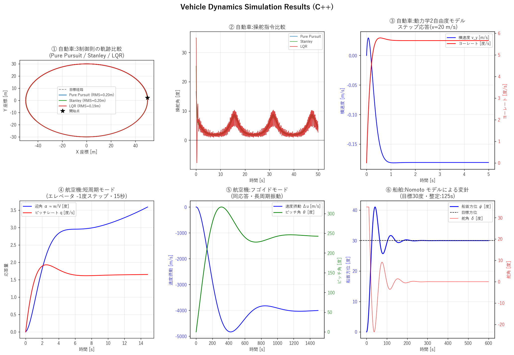

# Vehicle Dynamics Simulation

自動車・航空機・船舶の運動を、統一的な定式化でシミュレーションする教材プロジェクトです。

このリポジトリの主題は、次の問いに「動くコード」で答えることです。

> ロボットアームの教科書は必ずラグランジュ方程式で運動方程式を立てる。
> なのに、自動車・航空機・船舶の運動モデルはほとんど常に Newton-Euler
> 形式で書かれている。なぜ違うのか?

短い答えは「ラグランジュ形式が使えないのではなく、非ホロノミック拘束と
非保存力が支配する輸送機関では Newton-Euler のほうが素直で、ラグランジュ
形式の利点が活きないから」です。詳しい議論は以下のドキュメントを参照してください。

| ドキュメント | 内容 |
|---|---|
| [`docs/why_newton_euler.md`](docs/why_newton_euler.md) | なぜ車両モデルに Newton-Euler を使うのかの解説 |
| [`docs/equation_selection_guide.md`](docs/equation_selection_guide.md) | **用途に応じた力学定式化の選び方（詳細版）** — ラグランジュ・Newton-Euler・Kane の使い分けを実際のシミュレーション結果とともに解説 |

本リポジトリの輸送機関モデルはすべて Newton-Euler 形式で書かれています。
対比として、ラグランジュ法が自然な選択になる例(2リンクロボットアーム)も
[`python/lagrangian_arm.py`](python/lagrangian_arm.py) に置いてあります。

## 含まれるシミュレーション

| # | モデル | 内容 |
|---|---|---|
| 1 | 自動車・経路追従 | Pure Pursuit / Stanley / LQR / MPC の制御則比較(楕円経路) |
| 2 | 自動車・動力学 | 線形2自由度モデル。操舵ステップ応答とスタビリティファクタ |
| 3 | 航空機・縦運動 | 4自由度線形モデル。短周期モードとフゴイドモードの固有値解析 |
| 4 | 船舶・操船 | Nomoto 1次モデル + PD 制御による変針シミュレーション |

実装は2系統あります。

- **C++ 版** — 高速。`src/` 以下。Eigen で線形代数、結果を JSON 出力。
  制御則は Pure Pursuit / Stanley / LQR。
- **Python 版** — 手軽でグラフ付き。`vehicle_dynamics_simulation.py`(理論解説を
  豊富に含むスタンドアロン版)と、`python/` 以下の補助スクリプト群。

MPC は制約付き最適化(`scipy.optimize`)を使うため Python 版
(`python/run_mpc.py`)にのみ実装しています。C++ 版には含まれません。



## ディレクトリ構成

```
.
├── CMakeLists.txt                  C++ ビルド設定
├── build.sh / build.bat            ビルドスクリプト (Linux・macOS / Windows)
├── requirements.txt                Python 依存ライブラリ
├── src/                            C++ ソース (Newton-Euler 形式の各モデル)
├── python/
│   ├── compute_lqr_gain.py         LQR ゲインを CARE で計算し JSON 出力
│   ├── run_mpc.py                  MPC 経路追従 (Python 専用)
│   ├── gui_viewer.py               結果ビューア GUI (tkinter)
│   └── lagrangian_arm.py           対比用: 2リンクアームのラグランジュ法シミュレーション
├── vehicle_dynamics_simulation.py  Python スタンドアロン版 (理論解説つき)
├── visualize_results.py            C++ の results.json をグラフ化
├── docs/
│   └── why_newton_euler.md         なぜ Newton-Euler 形式を使うのかの解説
└── examples/                       サンプル入出力 (lqr_k.json, results.json)
```

## 使い方

### 方法 1: Python 版(手軽・グラフ付き、初めての方におすすめ)

```bash
pip install -r requirements.txt
python vehicle_dynamics_simulation.py
```

コンソールに理論解説と結果が出力され、`vehicle_dynamics_results.png` と
`vehicle_dynamics_ship_track.png` が生成されます。

### 方法 2: C++ 版(高速・JSON 出力)

**ビルド** — CMake 3.20 以上と C++20 対応コンパイラが必要です。
依存ライブラリ(Eigen 3.4.0、nlohmann/json 3.11.3)は CMake の
FetchContent が自動取得します。**初回ビルドはこのダウンロードのため
数分かかります**(ネットワーク環境に依存)。

```bash
# Linux / macOS
./build.sh

# Windows
build.bat
```

**LQR ゲインの事前計算**(任意)— LQR 制御則は連続時間 Riccati 方程式の解を
必要とします。これを Python(`scipy`)で計算して JSON で渡します。

```bash
python python/compute_lqr_gain.py        # lqr_k.json を生成
```

省略した場合、C++ 版は LQR にゼロゲインを使い、警告を表示します。

**実行** —

```bash
# Linux / macOS
./build/vehicle_dynamics                       # 既定: lqr_k.json を読み, results.json を出力
./build/vehicle_dynamics lqr_k.json out.json   # 入出力パスを指定

# Windows
build\Release\vehicle_dynamics.exe
```

ビルドジェネレータによって実行ファイルのパスが異なります。
Makefile 系(Linux・macOS の既定)では `build/vehicle_dynamics`、
MSVC では `build/Release/vehicle_dynamics.exe` です。

**結果の可視化** —

```bash
python visualize_results.py results.json      # cpp_results*.png を生成
```

### 結果ビューア GUI(任意)

C++ と Python の結果を統合表示する GUI です。tkinter(Python 標準ライブラリ)を
使います。一部の Linux ディストリビューションでは `python3-tk` の別途インストールが
必要です。

```bash
python python/gui_viewer.py
```

### 対比用: ラグランジュ法の例

```bash
python python/lagrangian_arm.py
```

2リンクロボットアームの運動方程式を `M(q) q̈ + C(q,q̇) q̇ + g(q) = τ` の形で
ラグランジュ法から立て、重力下の自由運動をシミュレーションします。
駆動トルクなしでは全エネルギーが保存されること(数値誤差レベル)も確認でき、
本体の Newton-Euler モデルとの対比になります。

## 動作環境

- C++20 対応コンパイラ(GCC 10+ / Clang 12+ / MSVC 2019+ など)
- CMake 3.20 以上
- Python 3.8 以上(`numpy`, `scipy`, `matplotlib`、GUI には `tkinter`)

## ライセンス

本プロジェクトは MIT License です([`LICENSE`](LICENSE) 参照)。

C++ 版はビルド時に以下のライブラリを取得します。これらはこのリポジトリには
同梱されませんが、ビルドした成果物にはそれぞれのライセンスが適用されます。

- [Eigen](https://gitlab.com/libeigen/eigen) 3.4.0 — Mozilla Public License 2.0
- [nlohmann/json](https://github.com/nlohmann/json) 3.11.3 — MIT License

## 参考文献

- R. Rajamani, *Vehicle Dynamics and Control*, Springer.
- B. Etkin and L. D. Reid, *Dynamics of Flight: Stability and Control*, Wiley.
- T. I. Fossen, *Handbook of Marine Craft Hydrodynamics and Motion Control*, Wiley.
